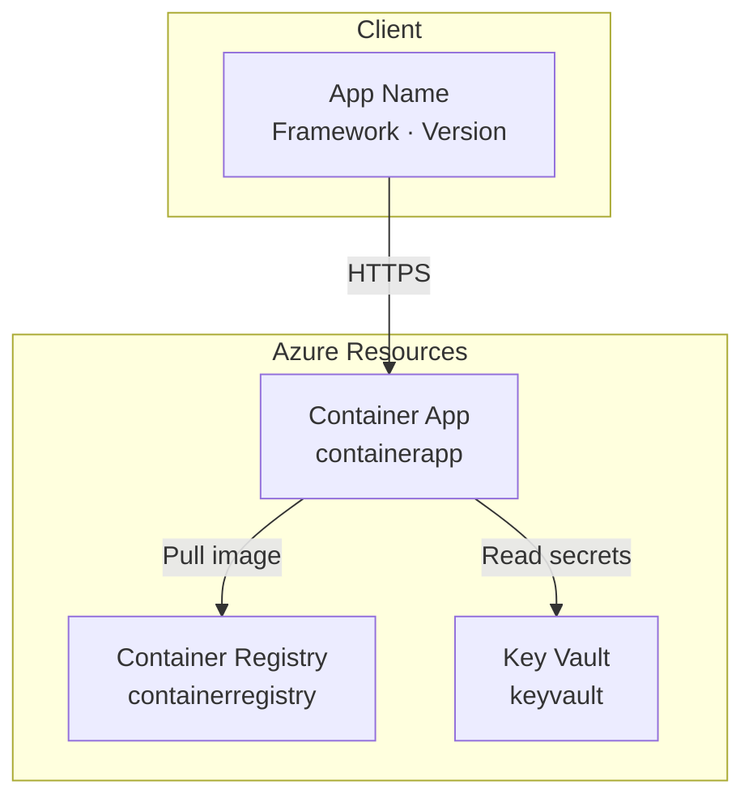

# Research: Architect Agent for Azure IaC

> Researched 2026-03-17 against the live Solune codebase and Azure MCP documentation.

---

## Topic 1: Azure MCP Server Installation and Configuration

### Decision

Use `npx @azure/mcp@latest server start` as the stdio command for both local (`.vscode/mcp.json`) and remote (`.github/agents/mcp.json`) MCP configurations. The Azure MCP server is GA 1.0 at `microsoft/mcp` (the archived `Azure/azure-mcp` repo is obsolete as of February 2026).

### Rationale

- The `npx @azure/mcp@latest` pattern is the canonical installation method per Microsoft's documentation.
- Using `npx` matches the existing pattern in `.vscode/mcp.json` (e.g., `npx @playwright/mcp@latest` for Playwright MCP, `npx @upstash/context7-mcp@1.0.31` for Context7).
- For `.github/agents/mcp.json`, the local/stdio pattern is used because remote GitHub Custom Agents run commands locally in the agent's execution environment. This matches the existing CodeGraphContext entry that uses `uvx`.
- The Azure MCP server provides: resource schema lookups (`get_az_resource_type_schema`), Bicep best practices (`get_bicep_best_practices`), Well-Architected Framework guidance, and live Azure resource queries (when authenticated).

### Alternatives Considered

| Alternative | Why not |
|---|---|
| VS Code extension `ms-azuretools.vscode-azure-mcp-server` | Extension-only approach doesn't work for remote agents; `npx` is universal |
| Self-hosted Azure MCP on Container Apps | Over-engineering for initial rollout; local/stdio is sufficient |
| HTTP-based Azure MCP endpoint | No public hosted endpoint exists; Azure MCP is local-first |

### Implementation Details

**`.vscode/mcp.json`** entry:
```json
"microsoft/azure-mcp": {
    "type": "stdio",
    "command": "npx",
    "args": [
        "@azure/mcp@latest",
        "server",
        "start"
    ]
}
```

**`.github/agents/mcp.json`** entry:
```json
"azure-mcp": {
    "type": "local",
    "command": "npx",
    "args": [
        "@azure/mcp@latest",
        "server",
        "start"
    ],
    "tools": ["*"]
}
```

---

## Topic 2: Bicep MCP Server Availability for Remote Agents

### Decision

The Bicep MCP server is auto-provided by the Bicep VS Code extension (`ms-azuretools.vscode-bicep`) and does NOT need a `mcp.json` entry. For remote GitHub Custom Agents where the extension is unavailable, the Azure MCP Server's built-in Bicep tool area plus Context7 for Bicep documentation serve as the fallback.

### Rationale

- The Bicep extension activates automatically when a `.bicep` file is present in the workspace. It exposes tools like `get_bicep_best_practices` and `get_az_resource_type_schema` via MCP.
- Remote agents cannot rely on VS Code extensions. However, the Azure MCP server (which IS configured for remote agents) includes Bicep-related tools as part of its tool set.
- Context7 can provide Bicep language documentation and Azure Verified Modules (AVM) patterns on demand.
- This dual-fallback strategy means the agent degrades gracefully: full Bicep MCP locally → Azure MCP + Context7 remotely.

### Alternatives Considered

| Alternative | Why not |
|---|---|
| Add Bicep MCP as a separate entry in `mcp.json` | Bicep MCP is extension-provided only; no standalone CLI command exists |
| Bundle Bicep CLI tools in agent image | Adds image complexity; Azure MCP's built-in Bicep tools are sufficient |
| Skip Bicep tooling for remote agents | Degrades IaC quality; Azure MCP + Context7 provide adequate coverage |

---

## Topic 3: GitHub Custom Agent File Structure and Conventions

### Decision

Model the Architect agent file after `designer.agent.md` for YAML frontmatter structure and `speckit.implement.agent.md` for MCP server inline declarations. The agent file includes: `name`, `description`, `mcp-servers` (Context7, CodeGraphContext, Azure MCP), and NO `handoffs` (Custom GitHub Agents don't support handoffs).

### Rationale

- Existing agents in `.github/agents/` use a consistent pattern: YAML frontmatter with `name`, `description`, optional `handoffs`, and `mcp-servers` block, followed by markdown instructions.
- `designer.agent.md` demonstrates the full pattern including handoffs (which we'll omit) and MCP server declarations with explicit tool lists.
- `speckit.implement.agent.md` shows the minimal MCP pattern (Context7 HTTP + CodeGraphContext local) that the Architect will extend with Azure MCP.
- The 15 existing prompt files all use the same minimal YAML format: `---\nagent: <agent-name>\n---`.

### Implementation Details

YAML frontmatter structure:
```yaml
---
name: Architect
description: Generates Azure IaC (Bicep), azd scaffolds, architecture diagrams,
  and deploy buttons for new Solune apps. Always invoked during app creation.
mcp-servers:
  context7:
    type: http
    url: https://mcp.context7.com/mcp
    tools:
    - resolve-library-id
    - get-library-docs
    headers:
      CONTEXT7_API_KEY: $COPILOT_MCP_CONTEXT7_API_KEY
  CodeGraphContext:
    type: local
    command: uvx
    args:
    - --from
    - codegraphcontext
    - cgc
    - mcp
    - start
    tools:
    - '*'
  azure-mcp:
    type: local
    command: npx
    args:
    - '@azure/mcp@latest'
    - server
    - start
    tools:
    - '*'
---
```

---

## Topic 4: GitHub Secrets API for Azure Credential Storage

### Decision

Implement a new `set_repository_secret()` method on the GitHub service layer that uses the GitHub REST API (`PUT /repos/{owner}/{repo}/actions/secrets/{secret_name}`) to store encrypted secrets. The method first retrieves the repository's public key via `GET /repos/{owner}/{repo}/actions/secrets/public-key`, encrypts the secret value using `libsodium` (PyNaCl), then PUTs the encrypted value.

### Rationale

- The GitHub Secrets API requires secrets to be encrypted with the repository's public key before storage. This is a two-step process: fetch the public key, then encrypt and store.
- No existing code in the codebase calls the GitHub Secrets API — this is a new capability.
- The existing `GitHubProjectsService` in `solune/backend/src/services/github_projects/` uses GitHubKit for REST and GraphQL calls. The Secrets API calls should follow the same pattern using `self._rest()`.
- PyNaCl (`pynacl`) is the standard Python library for `libsodium` encryption, which GitHub requires for secret encryption.
- The spec mandates that credentials are collected optionally during app creation and stored as `AZURE_CLIENT_ID` and `AZURE_CLIENT_SECRET`.

### Alternatives Considered

| Alternative | Why not |
|---|---|
| Store credentials in Solune's own database | Violates security principle — GitHub Secrets API provides encrypted-at-rest storage designed for CI/CD |
| Use GitHub CLI (`gh secret set`) | External dependency; not available in Docker runtime |
| Azure Key Vault for credential storage | Over-engineering for initial version; GitHub Secrets is the standard for CI/CD workflows |
| Skip credential storage; manual setup only | Reduces UX value; spec mandates automated storage |

### Implementation Details

```python
from nacl.public import SealedBox, PublicKey
import base64

async def set_repository_secret(
    self,
    access_token: str,
    owner: str,
    repo: str,
    secret_name: str,
    secret_value: str,
) -> None:
    """Store an encrypted secret in a GitHub repository."""
    # Step 1: Get repository public key
    key_data = await self._rest(
        access_token,
        "GET",
        f"/repos/{owner}/{repo}/actions/secrets/public-key",
    )
    public_key = key_data["key"]
    key_id = key_data["key_id"]

    # Step 2: Encrypt the secret using libsodium sealed box
    pk_bytes = base64.b64decode(public_key)
    sealed_box = SealedBox(PublicKey(pk_bytes))
    encrypted = sealed_box.encrypt(secret_value.encode())
    encrypted_b64 = base64.b64encode(encrypted).decode()

    # Step 3: Store the encrypted secret
    await self._rest(
        access_token,
        "PUT",
        f"/repos/{owner}/{repo}/actions/secrets/{secret_name}",
        json={"encrypted_value": encrypted_b64, "key_id": key_id},
    )
```

**Dependency**: `pynacl` package (adds ~1MB). Already widely used in the Python ecosystem.

---

## Topic 5: Mermaid Architecture Diagram Conventions

### Decision

Follow the established Mermaid diagram conventions from `solune/docs/architectures/` which uses 5 diagram types: `high-level.mmd`, `deployment.mmd`, `backend-components.mmd`, `frontend-components.mmd`, and `data-flow.mmd`. The Architect agent generates at minimum high-level and deployment diagrams for each new app.

### Rationale

- The existing `solune/docs/architectures/` directory contains 5 `.mmd` files that establish the project's diagramming conventions: `graph TB` orientation, `subgraph` for logical groupings, descriptive labels with `<br/>` for multi-line node text, and `-->` arrows with quoted labels.
- The Architect agent generates diagrams in the app's `docs/architectures/` directory (not the Solune root), following the same naming convention.
- Mermaid format is chosen because GitHub natively renders `.mmd` files in markdown preview, matching the existing documentation pattern.
- The high-level and deployment diagrams are mandatory (per spec FR-004); components and data-flow diagrams are generated based on project complexity.

### Alternatives Considered

| Alternative | Why not |
|---|---|
| PlantUML | Not natively rendered by GitHub; requires external tooling |
| Draw.io / Excalidraw | Binary formats; not diff-friendly in git |
| ASCII art | Limited expressiveness; harder to maintain |
| SVG export | Loses editability; Mermaid source is preferred |

### Implementation Details

Example generated diagram structure:


---

## Topic 6: Azure Developer CLI (`azd`) Scaffold Structure

### Decision

Generate `azure.yaml` at the repository root with service definitions, hooks, and environment configuration. The `azd` scaffold supports `azd init` / `azd up` / `azd deploy` workflow. The Bicep infrastructure goes in `infra/` with `main.bicep` as the entry point.

### Rationale

- `azure.yaml` is the standard manifest file for Azure Developer CLI. It defines services, their Docker/Dockerfile paths, and the infrastructure Bicep template location.
- The `infra/` directory is the `azd` convention for infrastructure code. `main.bicep` serves as the entry point that orchestrates per-resource modules.
- `main.bicepparam` provides environment-specific parameter values using `azd` environment variables (e.g., `readEnvironmentVariable('AZURE_ENV_NAME')`).
- This structure enables the standard `azd` workflow: `azd init` (configure env), `azd provision` (deploy infra), `azd deploy` (push app code).

### Alternatives Considered

| Alternative | Why not |
|---|---|
| Terraform | Spec explicitly excludes Terraform; Bicep is the exclusive IaC language |
| ARM JSON templates | Spec mandates Bicep over ARM JSON — always |
| Pulumi | Not an Azure-native tool; adds SDK dependency |
| `infra/` at repo root without `azure.yaml` | Loses `azd` integration; manual deployment only |

### Implementation Details

Standard `azure.yaml` structure:
```yaml
name: <app-name>
metadata:
  template: <app-name>@0.0.1
services:
  <service-name>:
    project: .
    language: <python|node|dotnet>
    host: containerapp
infra:
  provider: bicep
  path: infra
```

Standard `infra/` structure:
```
infra/
├── main.bicep           # Entry point — orchestrates modules
├── main.bicepparam      # Parameter values using azd env vars
├── abbreviations.json   # Azure resource abbreviations
└── modules/
    ├── containerApp.bicep
    ├── containerRegistry.bicep
    ├── keyVault.bicep
    └── monitoring.bicep
```

---

## Topic 7: Frontend Azure Credential Fields UX Pattern

### Decision

Add two optional input fields (Azure Client ID and Azure Client Secret) to the existing "New Repository Settings" section of the Create New App dialog in `AppsPage.tsx`. The Client Secret field uses `type="password"` for masking. Both fields appear only when `repo_type === 'new-repo'`. Frontend validates that either both are filled or both are empty.

### Rationale

- The current dialog already has a conditional "New Repository Settings" section (lines 450-515 of `AppsPage.tsx`) that appears when `repo_type === 'new-repo'`. Azure credential fields belong in this section.
- Using `type="password"` for the Client Secret is the standard browser input masking pattern and matches the spec requirement (US-2, AS-4).
- The paired validation (both or neither) prevents accidental submission of incomplete credentials, which the spec identifies as an edge case.
- Fields are optional — the app can be created without Azure credentials, and the agent still generates infrastructure code.

### Alternatives Considered

| Alternative | Why not |
|---|---|
| Separate settings page for Azure credentials | Adds navigation step; credentials are most useful at creation time |
| Modal overlay for credentials | Breaks flow; inline fields in existing section are cleaner |
| POST credentials in a separate API call | Adds complexity; credentials should travel with the create-app payload |

---

## Topic 8: Error Tolerance for Azure Credential Storage

### Decision

Implement a two-tier error tolerance model for Azure credential operations:
1. **Credential storage failure** → App creation succeeds but user is notified that Azure secrets were not stored. The app record is created normally.
2. **Architect agent invocation failure** → Non-blocking. App is created; infrastructure generation can be re-triggered manually.

### Rationale

- Azure credential storage is an enhancement, not a prerequisite for app creation. Following the existing pattern in `create_app_with_new_repo()` where project creation failure results in partial success (null project fields), credential storage failure should not block app creation.
- The spec edge case explicitly states: "The app creation still succeeds, but the user is notified that Azure credential storage failed."
- The Architect agent invocation is always attempted but its failure should not prevent the app from being functional.
- This matches the existing error tolerance pattern used for GitHub Project V2 creation/linking (lines 404-435 of `app_service.py`).

### Alternatives Considered

| Alternative | Why not |
|---|---|
| All-or-nothing (fail app creation if secrets fail) | Too strict; secrets can be added manually later |
| Retry in background | Adds complexity; user can retry via repo settings |
| Silent failure | Spec requires user notification; silent failure violates transparency |
